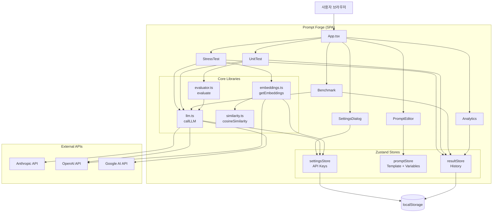
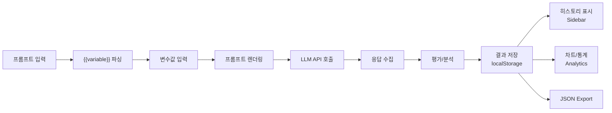
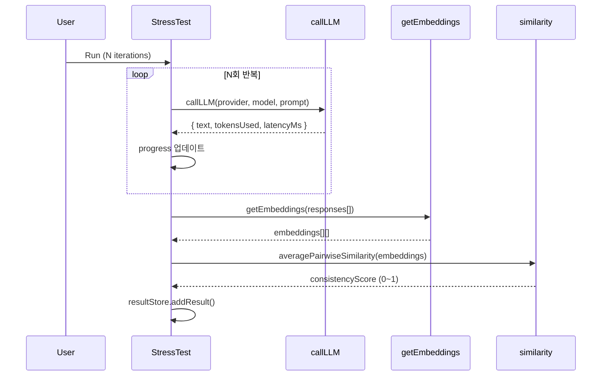
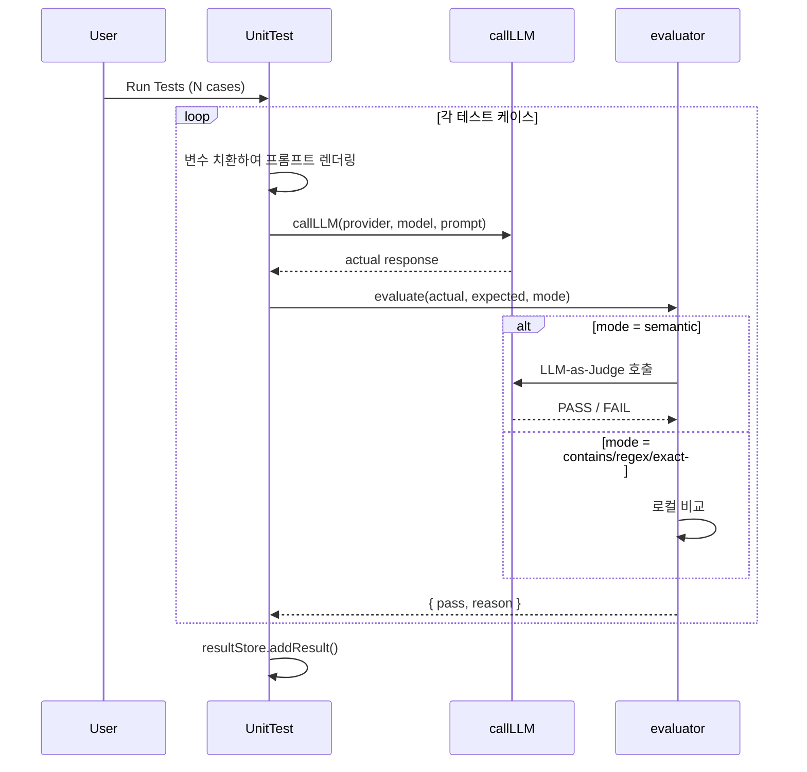
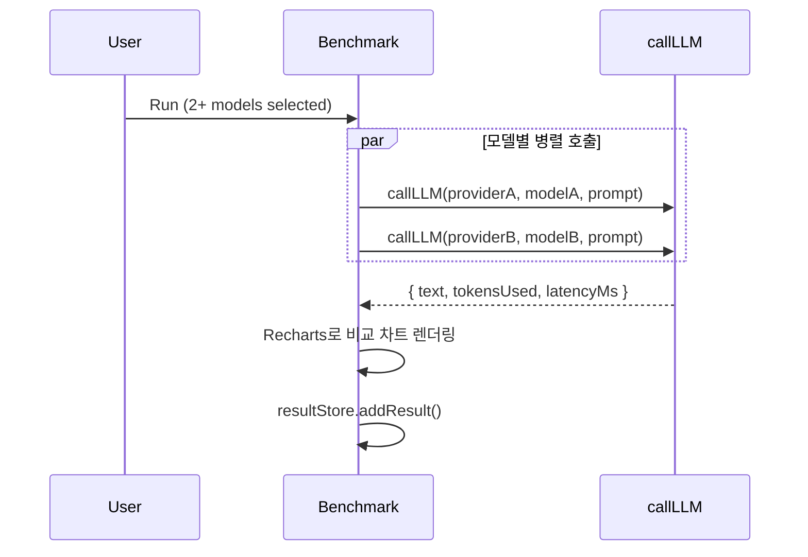
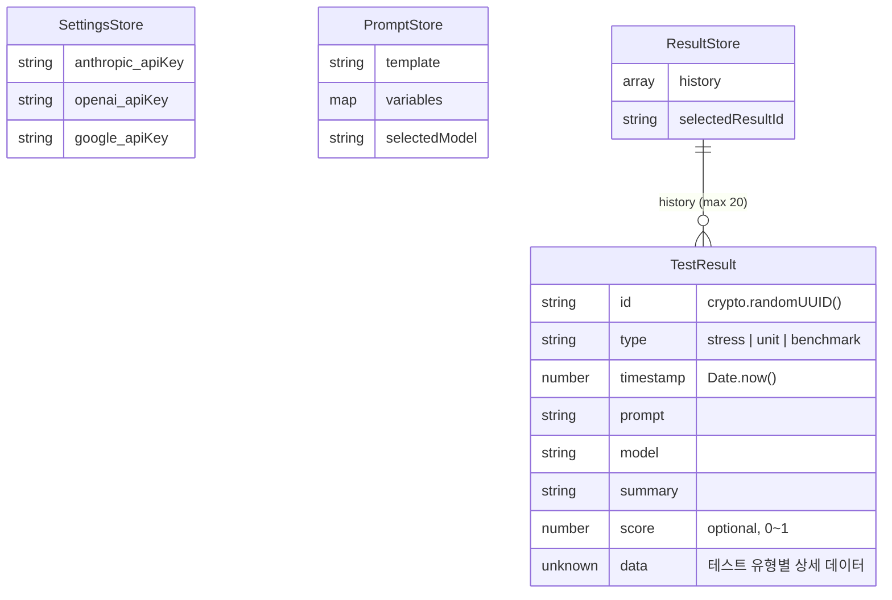

# Prompt Forge — 기술 문서

## 1. 프로젝트 개요

Prompt Forge는 LLM 프롬프트의 신뢰성을 데이터로 검증하는 클라이언트 사이드 웹 애플리케이션이다.

### 주요 기능

- **Stress Test**: 동일 프롬프트 N회 반복 실행 + 코사인 유사도 기반 일관성 점수
- **Unit Testing**: 변수 세트별 기대값 비교 (Semantic / Contains / Regex / Exact)
- **Model Benchmarking**: 멀티 모델 동시 호출 + 응답 시간/토큰 비교 차트
- **Analytics**: 히스토리 대시보드 + JSON Export

### 기술 스택

| 구분 | 라이브러리 |
|------|-----------|
| Framework | React 19 + TypeScript 5.9 |
| Build | Vite 8 |
| Styling | Tailwind CSS 4 + shadcn/ui (Base UI) |
| State | Zustand 5 (persist → localStorage) |
| Charts | Recharts 3 |
| LLM | Vercel AI SDK 6 (@ai-sdk/anthropic, openai, google) |

### 디렉토리 구조

```
src/
├── components/
│   ├── ui/                  # shadcn/ui 컴포넌트 (Button, Dialog, Tabs 등)
│   ├── layout/
│   │   └── sidebar.tsx      # 사이드바 (히스토리 목록 + Settings 버튼)
│   ├── prompt-editor.tsx    # 프롬프트 에디터 ({{variable}} 파싱)
│   ├── stress-test.tsx      # Stress Test UI
│   ├── unit-test.tsx        # Unit Test UI
│   ├── benchmark.tsx        # Model Benchmarking UI
│   ├── analytics.tsx        # Analytics 대시보드 + JSON Export
│   └── settings-dialog.tsx  # API Key 설정 모달
├── stores/
│   ├── settings-store.ts    # API Key 관리 (persist)
│   ├── prompt-store.ts      # 프롬프트 템플릿 + 변수 상태
│   └── result-store.ts      # 테스트 결과 히스토리 (persist, max 20)
├── lib/
│   ├── llm.ts               # LLM 호출 래퍼 (Vercel AI SDK)
│   ├── embeddings.ts        # OpenAI Embedding API 호출
│   ├── similarity.ts        # 코사인 유사도 계산
│   ├── evaluator.ts         # 비교 로직 (semantic/contains/regex/exact)
│   └── utils.ts             # cn() 유틸리티
├── App.tsx                  # 메인 앱 (레이아웃 + 탭 구성)
├── main.tsx                 # 엔트리포인트
└── index.css                # Tailwind + shadcn 테마
```

---

## 2. 아키텍처

### 시스템 구성도



### 주요 컴포넌트 간 관계

- **App.tsx**: Sidebar + PromptEditor + Tabs(Runner/Benchmark/Analytics) 레이아웃 조합
- **PromptEditor**: `promptStore`에 템플릿과 변수를 저장, 모델 선택은 `settingsStore` 기반
- **StressTest / UnitTest / Benchmark**: `promptStore`에서 프롬프트를 읽고, `lib/llm.ts`로 호출, 결과를 `resultStore`에 저장
- **Analytics**: `resultStore`의 히스토리를 읽어 통계 + 차트 렌더링
- **Sidebar**: `resultStore`의 히스토리 목록 표시 + Settings 진입점

### 데이터 흐름



---

## 3. 주요 기능 명세

### F01. 프롬프트 에디터

프롬프트 텍스트에서 `{{variable}}` 패턴을 정규식(`/\{\{(\w+)\}\}/g`)으로 파싱하여 변수 입력 필드를 자동 생성한다. 닫히지 않은 `{{`는 경고를 표시한다.

### F02. Stress Test



일관성 점수 기준:
- ≥ 0.95: Very Consistent (green)
- 0.7 ~ 0.95: Moderate (yellow)
- < 0.7: Unstable (red)

### F03. Unit Testing



비교 모드:
| 모드 | 로직 |
|------|------|
| `semantic` | LLM-as-Judge로 의미적 일치 판단 |
| `contains` | 대소문자 무시 포함 여부 |
| `regex` | 정규표현식 패턴 매칭 |
| `exact` | trim 후 정확히 일치 |

### F05. Model Benchmarking



---

## 4. 데이터 모델

### Zustand Store 구조



### 주요 타입/인터페이스

```typescript
// Provider 설정
type ProviderId = 'anthropic' | 'openai' | 'google'

// LLM 응답
interface LLMResponse {
  text: string
  tokensUsed: number
  latencyMs: number
}

// 평가 결과
type EvalMode = 'semantic' | 'contains' | 'regex' | 'exact'
interface EvalResult {
  pass: boolean
  reason: string
}

// 테스트 결과
type TestType = 'stress' | 'unit' | 'benchmark'
interface TestResult {
  id: string
  type: TestType
  timestamp: number
  prompt: string
  model: string
  summary: string
  score?: number
  data: unknown
}
```

### localStorage 키

| 키 | 내용 | 크기 제한 |
|----|------|----------|
| `prompt-forge-settings` | API Keys (프로바이더별) | 고정 (~200B) |
| `prompt-forge-results` | 테스트 히스토리 | 최대 20건 자동 관리 |

---

## 5. CORS 프록시 (API 명세 대용)

백엔드가 없으므로 API 엔드포인트 대신 Vite dev server proxy 설정을 명세한다.

| 프록시 경로 | 대상 | 용도 |
|------------|------|------|
| `/api/anthropic/*` | `https://api.anthropic.com/*` | Claude API 호출 |
| `/api/openai/*` | `https://api.openai.com/*` | GPT / Embedding API 호출 |
| `/api/google/*` | `https://generativelanguage.googleapis.com/*` | Gemini API 호출 |

> 프로덕션(GitHub Pages)에서는 프록시가 없으므로 CORS 제한이 적용된다. `npm run dev`로 로컬 실행 권장.

---

## 6. 설치 및 실행

### 사전 요구사항

- Node.js 22+
- API Key 1개 이상 (Anthropic, OpenAI, Google 중)
- Stress Test의 임베딩 유사도 측정에는 OpenAI API Key 필수

### 설치

```bash
git clone https://github.com/hgkang-suprema/prompt-forge.git
cd prompt-forge
npm install
```

### 실행

```bash
npm run dev      # 개발 서버 (CORS 프록시 포함)
npm run build    # 프로덕션 빌드
npm run lint     # ESLint
npm run preview  # 빌드 결과 미리보기
```

### 배포

- GitHub Pages 자동 배포: `main` 브랜치 push 시 `.github/workflows/deploy.yml` 실행
- GitHub 저장소 Settings → Pages → Source를 "GitHub Actions"로 설정 필요
